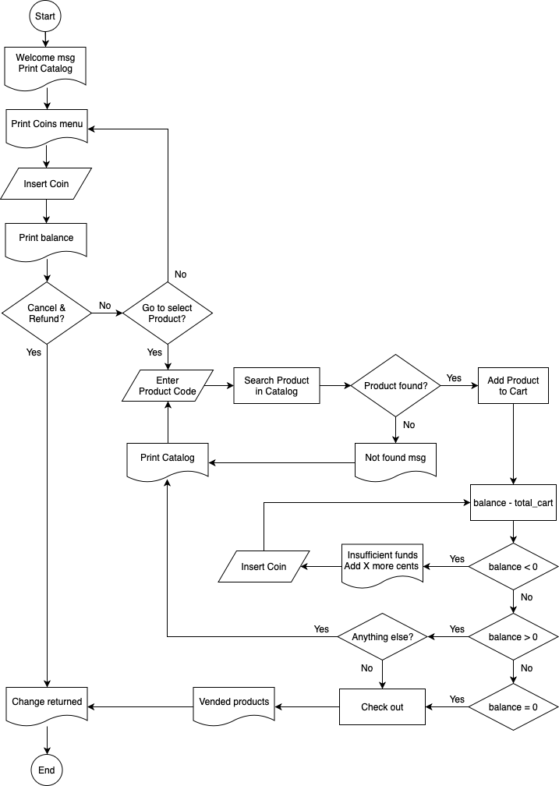

# Vending-Machine

This application tries to simulate the behavior of a vending machine. This is the entire diagram of the workflow that it follows and basically, these are all of the different options we expect to have.



### Usage

> Since this application was built using `ruby` you need to make sure you have it installed. You can follow the [instructions here](https://www.ruby-lang.org/en/documentation/installation/) depending on your operative system to install it.
> It is recommended to use at least `ruby version 2.6.3`.

To run the application first, in your terminal run the following command to clone this repo using the next command:

```sh
$ git clone https://github.com/alexventuraio/vending-machine
```

Then access the folder with:

```sh
$ cd vending-machine/
```

Now, run the entry point of the app with the next command:

```sh
$ ruby main.rb
```

At this point you will be able to see the main menu of the application in your terminal. Just follow the instructions on the screen to operate the machine.🎉🎉🎉

It will load the default CSV file `products.csv` which is included in this repository.

### Use a different CSV file for products menu

If you want to provide a different file, first make sure that the structure of each row meets the structure below. In this structure of the CSV file, each row is a product to be shown in the products menu.

| Name  | Code | Price |
| ----- | ---- | ----- |
| Water | C1   | 1.25  |
| Soda  | C3   | 2.99  |

**It is important to emphasize that you do not have to include any headers row in the file, just include product rows with the same structure. The final file could be something like this:**

| Water | C1  | 1.25 |
| ----- | --- | ---- |
| Soda  | C3  | 2.99 |

Once you have the file ready, you can execute the entry command but now
pass the path to the file as an argument as shown below:

```sh
$ ruby main.rb "spec/test_products.csv"
```

### Test suite

First, you need to make sure you have [RSpec](https://relishapp.com/rspec/docs/gettingstarted) installed. As required above, once you have `ruby` installed, install `RSpec` is pretty straightforward. Just run the following command inside the root folder of the application:

```sh
$ gem install rspec
```

Once your have `RSpec` in your system, you only have to run the following command to run the test suite.

```sh
$ bundle exec rspec
```
